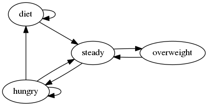

Technical details
=================

Algorithm
---------

Choices of allocation and deallocation are driven by a "finite state machine"
consisting of four states: steady, hungry, overfed, and diet.  The program will
move between these states as circumstances dictate, and apply different policies
depending on the current state.  This is how swapspace manages its tradeoffs
between the desire to free up unused swap space on the one hand, and on the
other, the desire to minimize deallocation and re-allocation (or "thrashing") of
swap files.

For those interested, here is a quick description of these states and their
associated policies:

Steady - normal operation; no additional swap space is needed, nor do we have
more than is needed.  However, the program can go into the hungry or overfed
states depending on memory usage.

Hungry - more swap space was recently allocated.  The program is willing to
allocate even more if needed, but to avoid thrashing, it's not going to drop
swap files.  If the system does not need more swap files for a certain period of
time, the program reverts to the steady state.

Overfed - significantly more virtual memory is available than is needed.  If
this situation persists for a certain timeout period, the program deallocates
one of its swap files and returns to the steady state.  If there's still too
much swap space, the program may come straight back to this state.

Diet - a recent allocation attempt has run into resource limits, e.g. because
the filesystem used for swap files was full.  No more swapspace can be allocated
but excess files can be freed up very rapidly.  Afer timeout, reverts to steady.

State information can be queried by sending the program the SIGUSR1 signal (see
"man 7 signal" to get the number for your architecture) which will cause it to
log debug information to the system's daemon log and/or standard output, as
appropriate.  The program can also be made to log state transitions by starting
it with the -v or --verbose option.
